# 一纸读书煲 · 使用说明书

**当前 APK 版本：1.0.0**  
一个有趣的精神庇护所：把纸书扫进锅里，慢炖成可搜索电子书和「一纸项目」，再把手写批注回锅加料。

浏览版（手机更好看）：[docs/manual/index.html](manual/index.html)


## 这锅怎么煮

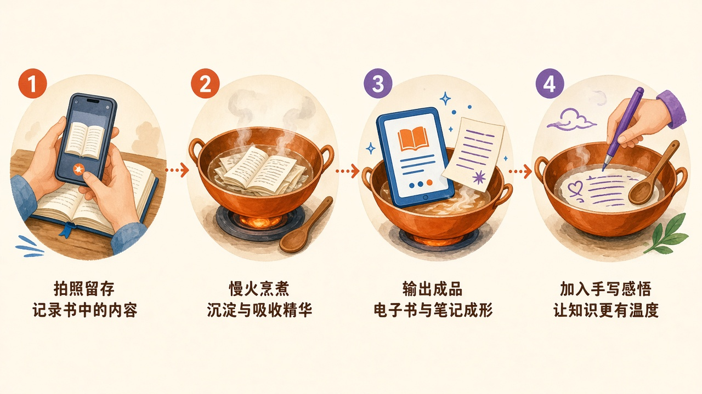

拍照备料 → 后台慢炖 → 阅读与一纸精华出锅 → 批注再回锅。数据跟邮箱走，换手机登录即可同步。

## 1. 安装 APK

1. 用手机打开当前版本安装包（约 54MB）。
2. 若提示禁止未知来源，在设置里允许该文件管理器 / 浏览器安装应用。
3. 打开 **一纸读书煲**。

这是 Android 侧载包。服务器已在云端，不必再开电脑。

## 2. 连接服务器并登录

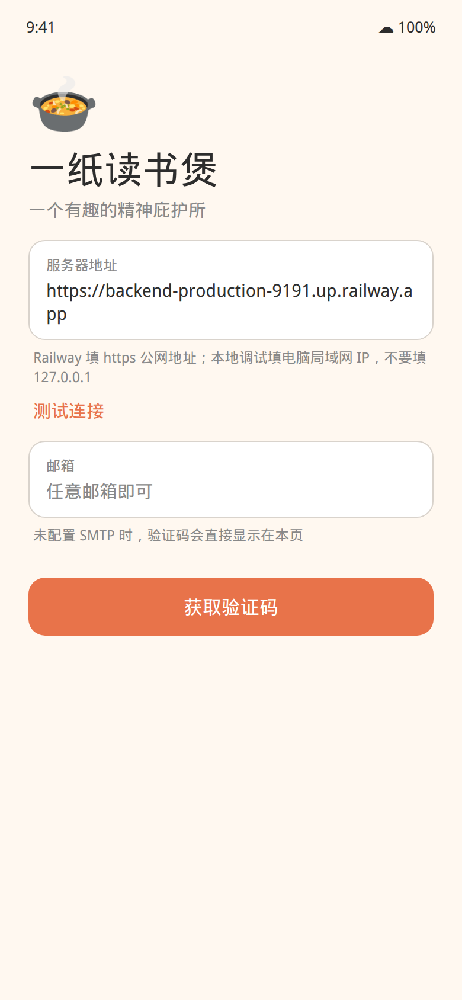

把下面地址填进「服务器地址」，点 **测试连接**，看到绿色「已连通」再继续：

```
https://backend-production-9191.up.railway.app
```

- 只贴主机名也可以，App 会自动补 `https://`。
- 不要填 `127.0.0.1`。

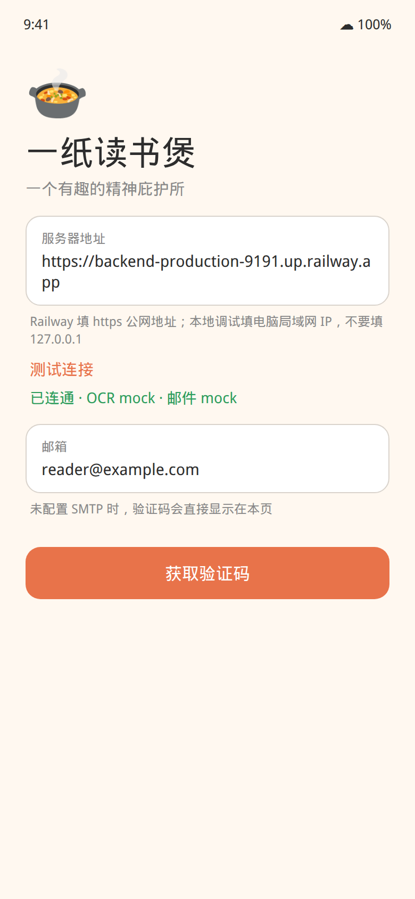
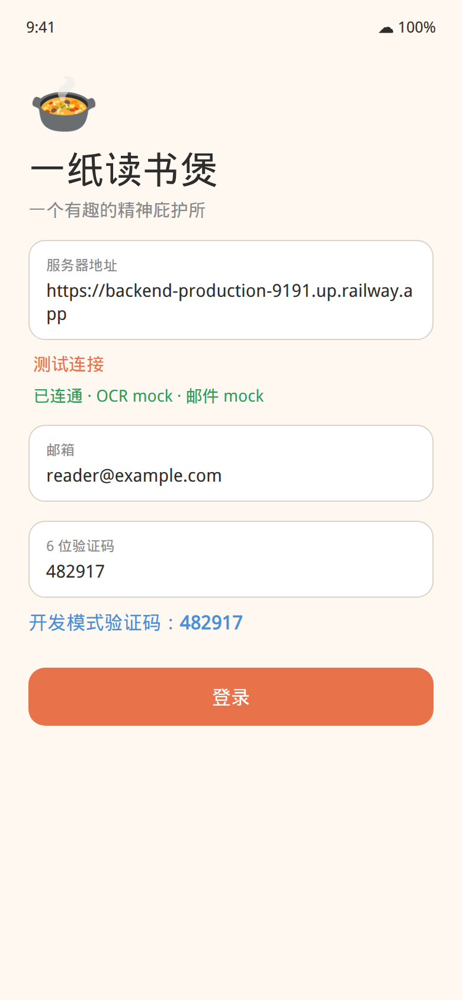

1. 邮箱填任意有效格式。
2. 点 **获取验证码**。当前未开通真实邮件，**6 位数字会出现在登录页蓝色提示里**。
3. 填入后点 **登录**。

以后若配置了 SMTP，验证码会发到邮箱，蓝色提示不再出现。

## 3. 我的锅


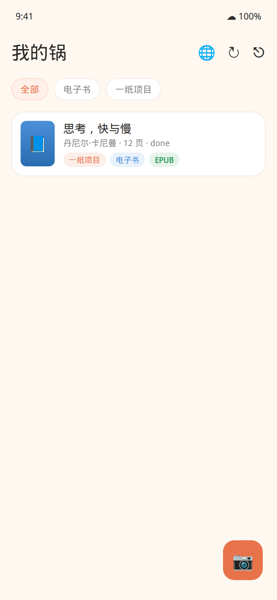

- 右下角橙色相机：开始自炊
- 右上角：改服务器、同步、退出
- 筛选：全部 / 电子书 / 一纸项目

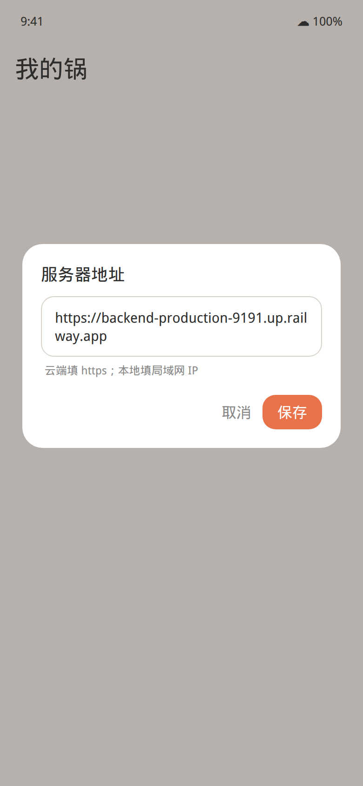

## 4. 自炊：扫描纸书

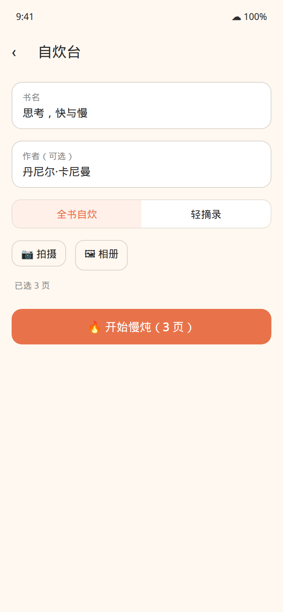

1. 填书名，作者可选。
2. 选 **全书自炊** 或 **轻摘录**。
3. **拍摄** 或 **相册** 加入书页，至少 1 页。
4. 点 **开始慢炖**。

光线均匀、文字平铺、一次一页。页序就是之后电子书的页序。

## 5. 慢炖与出锅

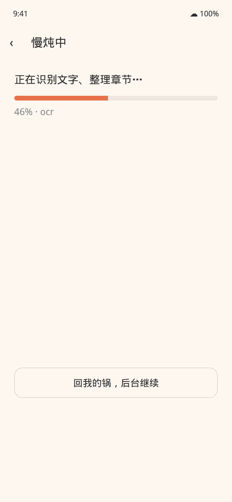
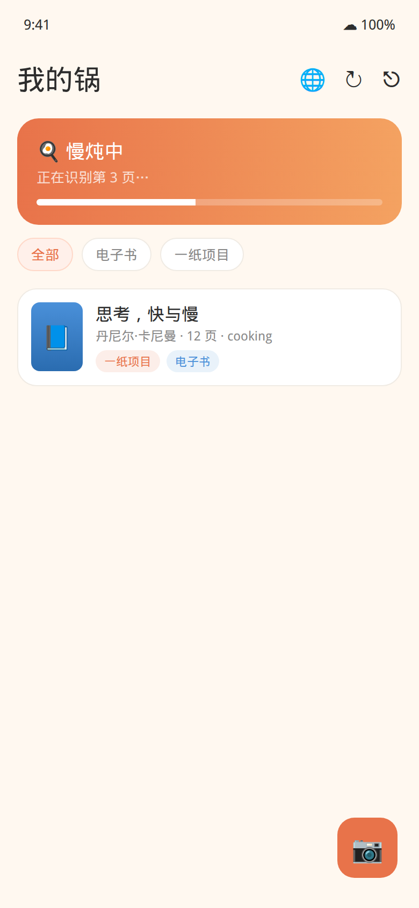

可以点「回我的锅，后台继续」。完成后进入书首页：


## 6. 阅读、搜索、翻译、导出

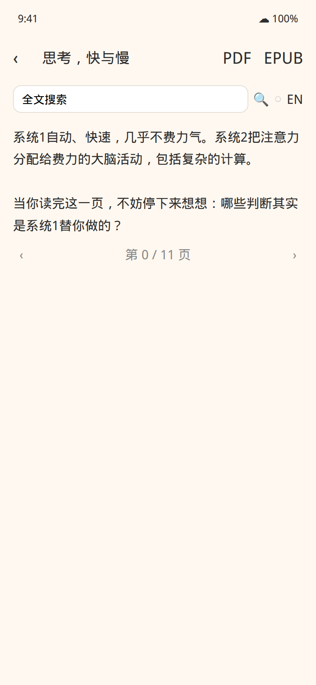
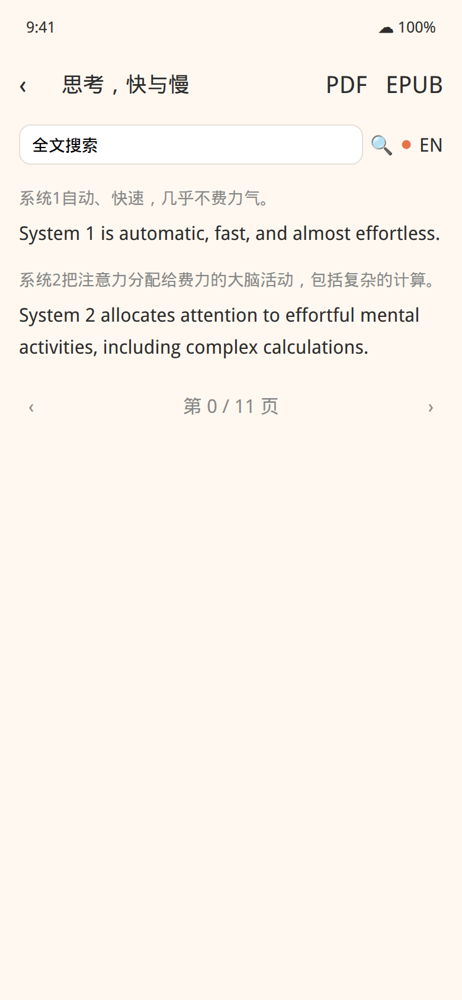

- 搜索框：全文搜索并跳页
- 开关 + EN / JA / ZH：按段翻译（有缓存）
- PDF / EPUB 图标：导出后走系统分享
- 底部箭头翻页

当前 OCR 与翻译默认是 **Mock**：流程完整，但不是真实书页文字。接上百度 OCR、通义千问后同一套按钮即出真内容。

## 7. 一纸项目

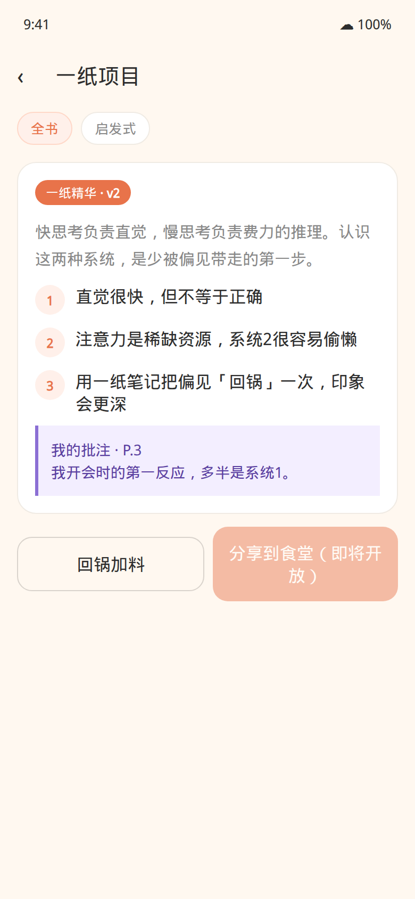

慢炖后生成全书摘要、关键洞察、章节提纲。回锅后个人批注出现在紫色卡片，版本号 +1。「分享到食堂」即将开放，当前不可用。

## 8. 一纸笔记本 / 回锅加料

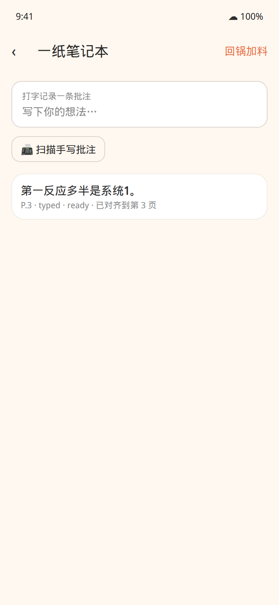


打字发送，或扫描书上的手写（页码从 0 起，可空）。点一条可修正识别。右上角 **回锅加料** 会把批注炖进一纸项目。

## 9. 多设备同步

另一部安卓安装同一 APK，填同一服务器，用同一邮箱登录，点「我的锅」同步即可。

## 10. 常见问题

**连不上**  
检查 `https://`、有没有空格。电脑调试时手机必须同一 Wi-Fi，后端监听 `0.0.0.0:8000`。

**收不到邮件**  
验证码显示在登录页，不用查邮箱。

**识别不像我的书**  
Mock 模式。真实 OCR / 摘要需要百度与通义密钥。

**删除书**  
书首页右上角删除，同步后其他设备也会看不到。

## 这一版有什么、没有什么

有：邮箱验证码登录、扫描自炊、慢炖、PDF / EPUB、搜索与翻译、一纸项目、笔记本与回锅、多设备同步。

没有：一纸食堂、AI 搭子自由对话、应用内付费、iOS 安装包。
