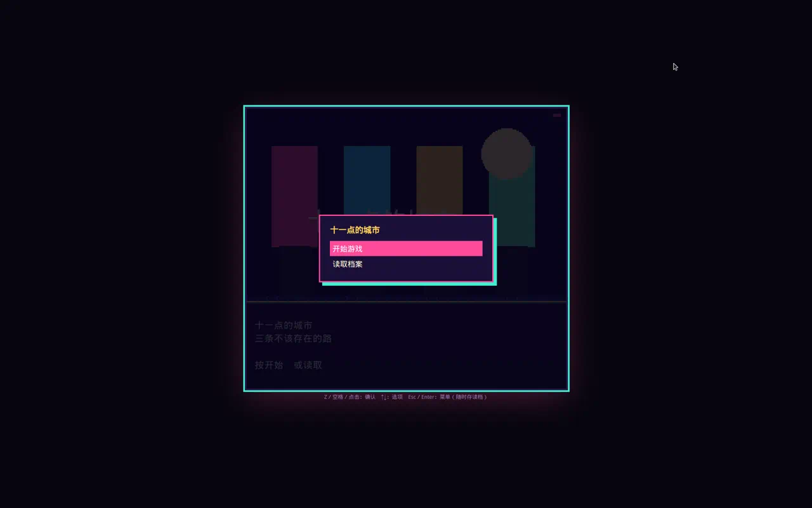
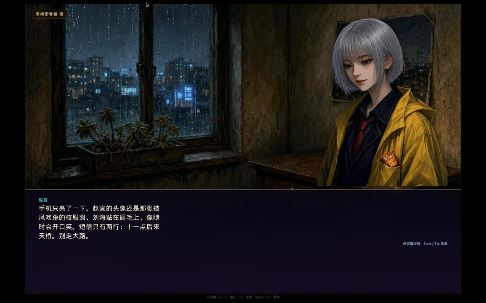
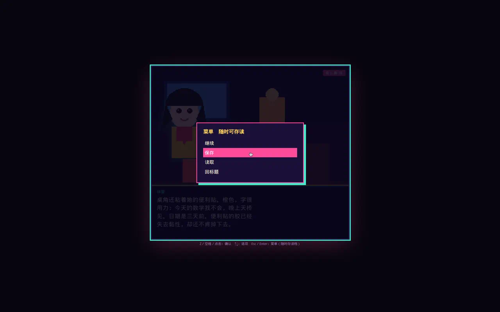

# 十一点的城市

彩色都市灵异文字冒险。故事发生在北京。赵宜失踪第三天，短信把你约到南城天桥。三条路：西单倒带馆、北京海洋馆、无名地铁。每条线有关键抉择和独立结局。

从零写的原创作品，不是任何商业游戏的汉化。

<p align="center">
  
  
  
</p>

## 怎么玩（推荐网页）

用浏览器打开 `player/index.html`（需本地服务器，见下）。绘画立绘与场景参考《弟切草》《彼岸花盛开之夜》的音小说气质，随时存读三格档。

```bash
cd sfc-vn
python3 tools/export_web.py
python3 -m http.server -d player 8765
```

然后访问 `http://127.0.0.1:8765`。

网页画布按 **3:2** 铺满窗口（960×640 及等比放大），方便在 AYANEO Pocket MICRO（3.5 寸 960×640 横屏）上玩。小屏建议浏览器「添加到主屏幕」全屏打开，字会更好认。

Pocket MICRO 可用实体键：十字键上下选，A／下键确定，B／Start 开菜单。若 AB 反了，在 AYASpace 把 ABXY 改成 Xbox 布局。也仍可用触摸。

## 掌机 APK（AYANEO Pocket MICRO）

真机侧载：`dist/city11.apk`（包名 `cn.dawei.city11`）。横屏全屏，存档写在应用本地，返回键开游戏菜单而不是退出。

1. 把 APK 拷到掌机，允许「安装未知应用」后点安装。
2. 若 A／B 反了，在 AYASpace 把 ABXY 改成 Xbox 布局。
3. 卸载重装会清档；覆盖安装（同一签名）会保留存档。

从源码再打一包：

```bash
# 需要 Android SDK（platforms;android-34 与 build-tools;34.0.0）
export ANDROID_SDK=$HOME/android-sdk
make apk
```

网页同时听 **Android 键码**（十字键 19/20、A=96、B=97、Start=108）和 **Gamepad API**。WebView 里通常是键码在干活。原生层不要把按键吃掉。

- **点屏幕 / A / Z / 空格**：继续、确认
- **↑↓ / 点选项**：移动或选定选项
- **Start / B / Esc**：菜单，随时保存、读取或退出

单条线大约六七十分钟纯阅读，加上看画面和存档，一轮约一个半到两小时。三条线从开场重玩，大约五小时。

## 超任卡带

`dist/city11.sfc` 可用 Snes9x / bsnes / RetroArch 打开。

- **Start**：进游戏；游戏中 **Start 存档**（SRAM 槽）
- **Select**：读档
- **A**：继续 / 确认
- **上下**：选项

## 从源码重建

```bash
python3 -m pip install pillow pytest
make test
make web
make rom
```

## 文档

- [设计理念](docs/设计理念.md) — 为什么这样写，选择为什么没有正确答案
- [完整剧本](docs/完整剧本.md) — 全部对白、分支与九个结局（可由 `python3 tools/export_script.py` 重生成）

## 目录

- `game/route_*.py` — 开场与三条分支剧本
- `player/` — 彩色网页运行时
- `tools/art.py` — 场景与立绘
- `tools/build_rom.py` — 65816 引擎与 `.sfc`
