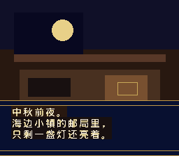
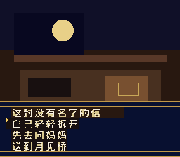

# 月见桥

一款原创 **SFC / 超任** 文字冒险视觉小说。中秋前夜，邮局里出现一封折成纸船、没有名字的信；你在月见桥上决定它的去向。

游戏是从零写的 65816 引擎，不是任何商业卡带的修改或汉化。

<p align="center">
  
  
  
</p>

## 怎么玩

1. 用任意超任 / SNES 模拟器打开 `dist/yuejianqiao.sfc`（Snes9x、bsnes、RetroArch 均可）。
2. 标题画面按 **Start**。
3. 对话按 **A** 继续。
4. 选项用 **十字键上下** 移动，**A** 确定。
5. 三个结局：灯火团圆、信去远方、桥上守候。结局后回到标题。

## 从源码重建

```bash
python3 -m pip install pillow pytest
make test
make rom
```

依赖系统里的中文字体 `fonts-wqy-microhei`，用来把剧本里实际用到的汉字打成 16×16 点阵。

## 目录

- `game/story.py` — 剧本与分支
- `tools/build_rom.py` — 65816 引擎与 ROM 组装
- `tools/snes_gfx.py` — 字库、场景、4bpp 转换
- `tools/mini_snes.py` — 本游戏用的迷你模拟器（测试 / 出图）
- `dist/yuejianqiao.sfc` — 可直接玩的卡带镜像
